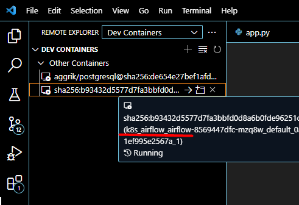
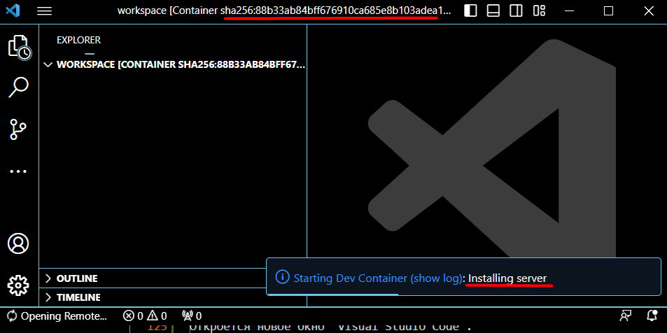
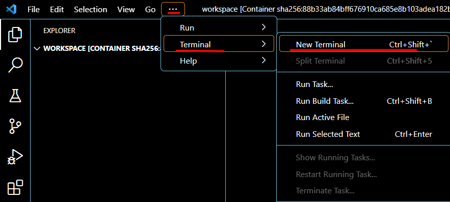
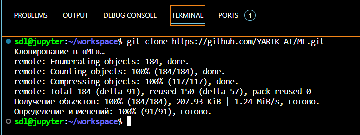
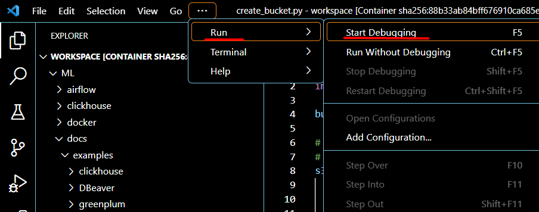
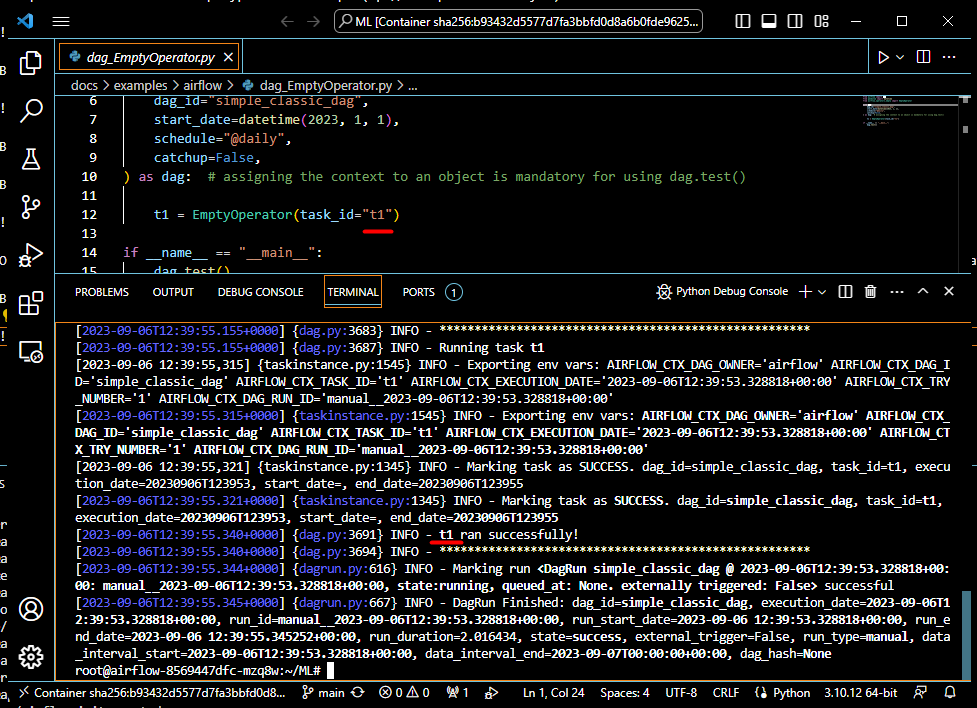

# Инструкция по планировщику

# Запуск демонстрационного примера

В  панели `Visual Studio Code` выберите зайти в расширение "Remote Explorer" в раздел "Dev Containers".

В списке выберите контейнер "k8s_airflow_airflow-...". 

Затем в контекстном меню запустите "Attach in New Window".

Откроется новое окно `Visual Studio Code`. В контейнере запустится процесс установки дополнительных компонет, это может занять некоторое время, время зависит от скорости интернета и вычислительных ресурсов компьютера (среднее время 1-2 минуты).

В новом окне `Visual Studio Code` откройте "Terminal".

В окне терминала выполните клонирование проекта над которым вы работете. Далее будет показано на примере проекта "YARIK JS".

Выполните команды клонирования вашего репозитария `git clone https://github.com/YARIK-AI/ML.git`

Откройте файл `dag_EmptyOperator.py` из папки `airflow` (для проекта YARIK это путь `docs/examples/airflow`), в этой папке лежат файлы с тестами. 

В  панели `Visual Studio Code` выберите меню "Run" -> "Start Debugging".

В терминале можно будет наблюдать успешный запуск задачи планировщика.

