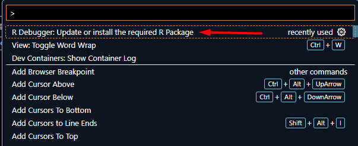

# Инструкция по разработке витрин

При построении витрин данных используется компонент визуализации инструмент `Shiny` (https://shiny.posit.co/). Shiny, это набор программных библиотек позволяющих формировать пользовательский веб-интерфейс, а для визуалного представления данных использовать библиотеки python либо R, такие как mathplotlib, plotly и т.д..

## Примеры на языке python

### Подготовка окружения

Перейдите в режим работы внутри контейнера, для этого выполните инструкцию "Инструкция программиста" раздел "Пошаговая отладка кода". В контейнере установите расширение Shiny for Python (vscode:extension/Posit.shiny-python) для `Visual Studio Code`.

Затем создайте файл с именем `app.py`. Содержимое файла можно взять с сайта `https://shiny.posit.co/py/docs/overview.html`.

Для запуска программы, в правом верхнем углу выберите пункт "Run Shiny App".


Внешний вид окна будет следущим.


## Примеры на языке R

### Подготовка окружения

Перейдите в режим работы внутри контейнера, для этого выполните инструкцию "Инструкция программиста" раздел "Пошаговая отладка кода". 

Затем создайте файл с именем `app.R`. Содержимое файла можно взять с сайта `https://shiny.posit.co/r/getstarted/shiny-basics/lesson1/index.html`.

Откройте файл. В правом нижнем углу появится предложение установить расширение. Установите расширение "R Extension for Visual Studio Code".


В "VSCode" выбрать пункт меню "Run" -> "Start Debugging"


При первом запуске будет выдаваться сообщение с предложением установить необходимые расширения.


Установите расширение "R Debugger".

При повторном нажатии "Start Debugging" может появится сообщение об ошибке.


Что бы это сообщение не появлялось, нажмите сочетание клавишь Ctrl+Shift+P и выберите установку r.debugger.updateRPackage



Перед тем как выполнить код, не забудьте поставить запуск приложения Shiny, в конце кода добавляется строка:

```
runApp(shinyApp(ui,server))
```

Команда `runApp` запускает локальный сервер Shiny. В примерах эта операция не добавляется поскольку предполагается, что сервер заранее запущен.

После успешного запуска, будет предложено открыть страницу в браузере либо стрица откроется самостоятельно.

