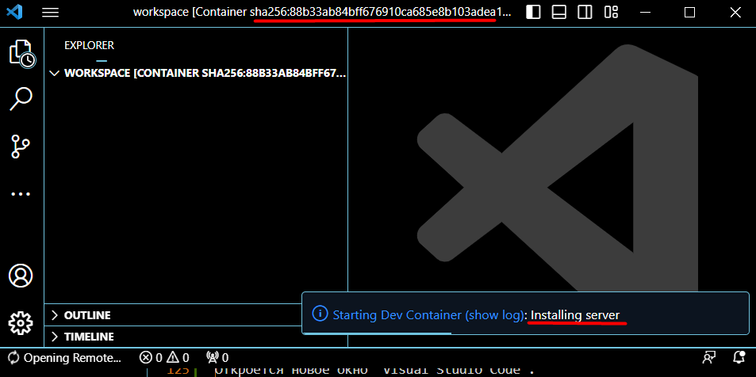

# Инструкция по тестированию

## Инструкция по разработке автоматических тестов на языке python.

В  панели `Visual Studio Code` выберите зайти в расширение "Remote Explorer" в раздел "Dev Containers".


В списке выберите контейнер "k8s_jupyter_yupyter-...". 


Затем в контекстном меню запустите "Attach in New Window".


Откроется новое окно `Visual Studio Code`. В контейнере запустится процесс установки дополнительных компонет, это может занять некоторое время, время зависит от скорости интернета и вычислительных ресурсов компьютера (среднее время 1-2 минуты).



В новом окне `Visual Studio Code` откройте "Terminal".


В окне терминала выполните клонирование проекта над которым вы работете. Далее будет показано на примере проекта "YARIK OpenML".

Выполните команды установки имени пользователя, подставьте свои актуальные данные:

```
git config --global user.name "<имя пользователя github>"
git config --global user.email "<ваша общедоступная>@<почта>.<ру>"
```

Выполните команды клонирования вашего репозитария `git clone https://github.com/YARIK-AI/ML.git`


Откройте любой программный код. `Visual Studio Code` предложит установить необходимые расширения для работы с python, после того как в редакторе откроете файл с расширением `.py`, при достаточно быстром интернете и компьютере, установка дополнительных плагинов происходит незаметно.


Откройте папку tests, в этой папке лежат файлы с тестами. Для проекта YARIK это путь `docs/examples/tests/`.


Откройте любой файл теста, слева на панели появится иконка "Testing"


Запустите тесты. Для некоторых тестов потребуется предварительно включить соответсвующие компоненты, например базы данных.

