# Инструкция программиста

## Введение

Все инструкции написаны в markdown, `Visual Studio Code` по умолчанию не дает возможности просмативать страницы markdown. Для посмотра инструкций нужно воспользоваться вариантами:

### Вариант 1

Просматривать инструкции непосредственно на сайте https://github.com/ по следующим ссылкам

[Инструкция программиста](https://github.com/YARIK-AI/ML/blob/main/docs/%D0%B8%D0%BD%D1%81%D1%82%D1%80%D1%83%D0%BA%D1%86%D0%B8%D0%B8/%D0%B8%D0%BD%D1%81%D1%82%D1%80%D1%83%D0%BA%D1%86%D0%B8%D1%8F%20%D0%BF%D1%80%D0%BE%D0%B3%D1%80%D0%B0%D0%BC%D0%BC%D0%B8%D1%81%D1%82%D0%B0/%D0%B8%D0%BD%D1%81%D1%82%D1%80%D1%83%D0%BA%D1%86%D0%B8%D1%8F%20%D0%BF%D1%80%D0%BE%D0%B3%D1%80%D0%B0%D0%BC%D0%BC%D0%B8%D1%81%D1%82%D0%B0.md)

[Инструкция по развертыванию](https://github.com/YARIK-AI/ML/blob/main/docs/%D0%B8%D0%BD%D1%81%D1%82%D1%80%D1%83%D0%BA%D1%86%D0%B8%D0%B8/%D0%B8%D0%BD%D1%81%D1%82%D1%80%D1%83%D0%BA%D1%86%D0%B8%D1%8F%20%D0%BF%D0%BE%20%D1%80%D0%B0%D0%B7%D0%B2%D0%B5%D1%80%D1%82%D1%8B%D0%B2%D0%B0%D0%BD%D0%B8%D1%8E/%D0%B8%D0%BD%D1%81%D1%82%D1%80%D1%83%D0%BA%D1%86%D0%B8%D1%8F%20%D0%BF%D0%BE%20%D1%80%D0%B0%D0%B7%D0%B2%D0%B5%D1%80%D1%82%D1%8B%D0%B2%D0%B0%D0%BD%D0%B8%D1%8E.md)

### Вариант 2

Установить расширение `learn-preview` к `Visual Studio Code`. Затем в контекстном меню к файлам markdown появится опция `Open Preview` (Ctrl + Shift + V).


## Подготовительные действия

Настроить окружение `Visual Studio Code`, для этого установить следующие расширения:

- ms-azuretools.vscode-docker
- ms-toolsai.jupyter
- ms-vscode-remote.remote-containers
- ms-kubernetes-tools.vscode-kubernetes-tools

Убедиться, что необходимые модули запущены, зайти в расширение `Kubernates` в раздел 
`Clusters` -> `Workloads` -> `Pods`. Должен отображаться список запущенных модулей.


* [Работа в jupyter-notebook](#работа-в-jupyter-notebook)

## Работа в jupyter-notebook

Открыть любой из примеров находящихся в папке `docs/examples`.

В правом верхнем углу jupyter-notebook открыть окно выбора ядра исполнения.


Выбрать 'Select Another Kernel'


Выбрать 'Existing jupyter Server ...'


Выбрать 'Existing jupyter Server ...'


Указать адрес сервера

`http://localhost:31188/jupyter/?token=822fce15430e96de9bc18fedf9f938796db4c7927f912028`

или (если ранее настраивали перенаправление порта)

`http://localhost:8888/jupyter/?token=822fce15430e96de9bc18fedf9f938796db4c7927f912028`

Указать имя соединения, например, `local`

Выбрать ядро


Выполнить пример, код будет выполнен внутри контейнера.

В самом начале всех примеров вызываются переменные окружения, примеры не смогут выполнится вне контейнеров, даже если у вас на компьютере был установлен python и jupyter. Успешное выполнение любого примера, это гарантия, что код выполнился в контейнере.

## Работа в скриптовом режиме

Предварительно необходимо проверить настройку горячих главиш в `Visual Studio Code`. Перейдите в раздел "File" -> "Preferences" -> "Keyboard Shortcuts"

В строке поиска введите `Terminal: Run Selected Text In Active Terminal`

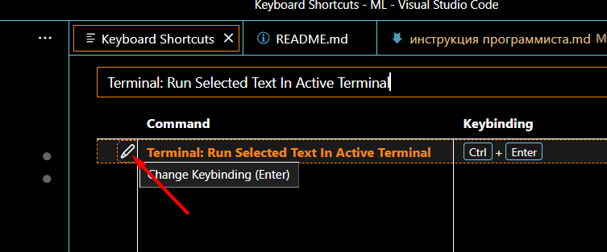

Установите сочетание клавишь `Ctrl + Enter`.

В  панели `Visual Studio Code` выберите зайти в расширение `Kubernates` в раздел 
`Clusters` -> `Workloads` -> `Pods` в контекстном меню контейнера "jupyter-..." выберите пункт "Terminal"

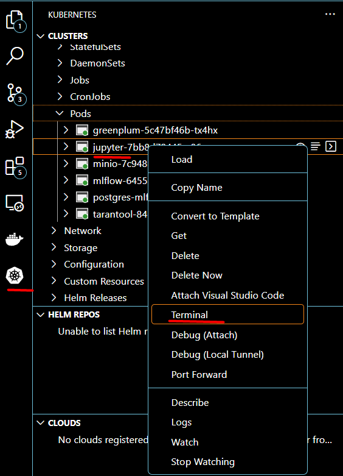

Откроется терминал коммандной строкой и приглашением ввода.

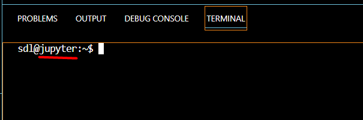

В терминале запустите интрепретатор `python`.

Создайте новый файл, например, с таким программным кодом:

```python
import pandas as pd

d = {'col1': [1, 2], 'col2': [3, 4]}
df = pd.DataFrame(data=d)
df
```

Установите курсор на первую строку кода, нажмите Ctrl + Enter, программный код выполнится в интерпертаторе python.

Выделите несколько строк кода, нажмите Ctrl + Enter, программный код выполнится в интерпертаторе python.

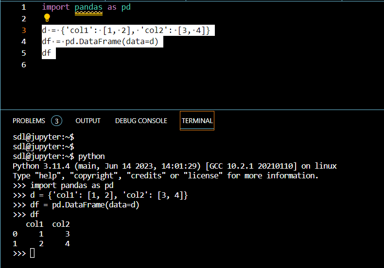

## Пошаговая отладка кода

В  панели `Visual Studio Code` выберите зайти в расширение "Remote Explorer" в раздел "Dev Containers".

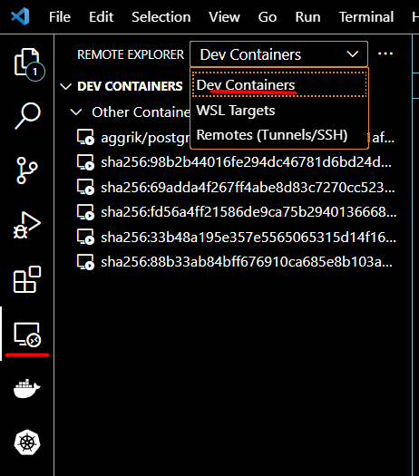

В списке выберите контейнер "k8s_jupyter_yupyter-...". 

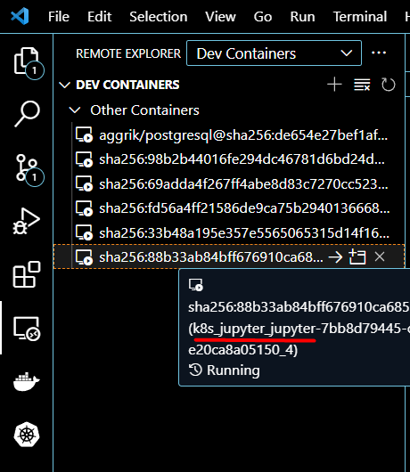

Затем в контекстном меню запустите "Attach in New Window".

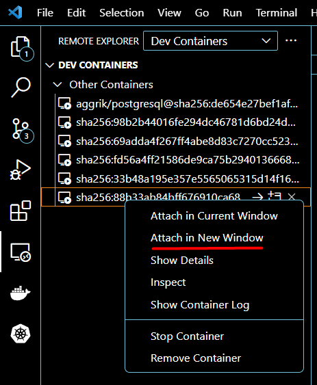

Откроется новое окно `Visual Studio Code`. В контейнере запустится процесс установки дополнительных компонет, это может занять некоторое время, время зависит от скорости интернета и вычислительных ресурсов компьютера (среднее время 1-2 минуты).

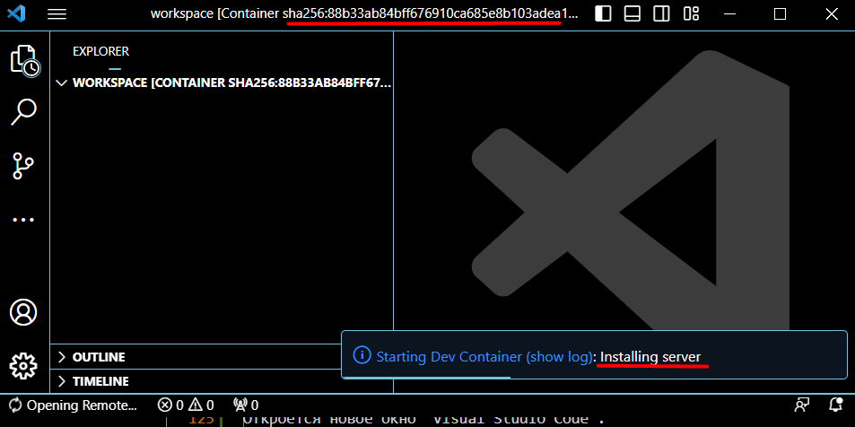

В новом окне `Visual Studio Code` откройте "Terminal".


В окне терминала выполните клонирование проекта над которым вы работете. Далее будет показано на примере проекта "YARIK OpenML".

Выполните команды установки имени пользователя, подставьте свои актуальные данные:

```
git config --global user.name "<имя пользователя github>"
git config --global user.email "<ваша общедоступная>@<почта>.<ру>"
```

Выполните команды клонирования вашего репозитария `git clone https://github.com/YARIK-AI/ML.git`


Откройте любой программный код. `Visual Studio Code` предложит установить необходимые расширения для работы с python, после того как в редакторе откроете файл с расширением `.py`, при достаточно быстром интернете и компьютере, установка дополнительных плагинов происходит незаметно.

Установите точку останова программного кода.

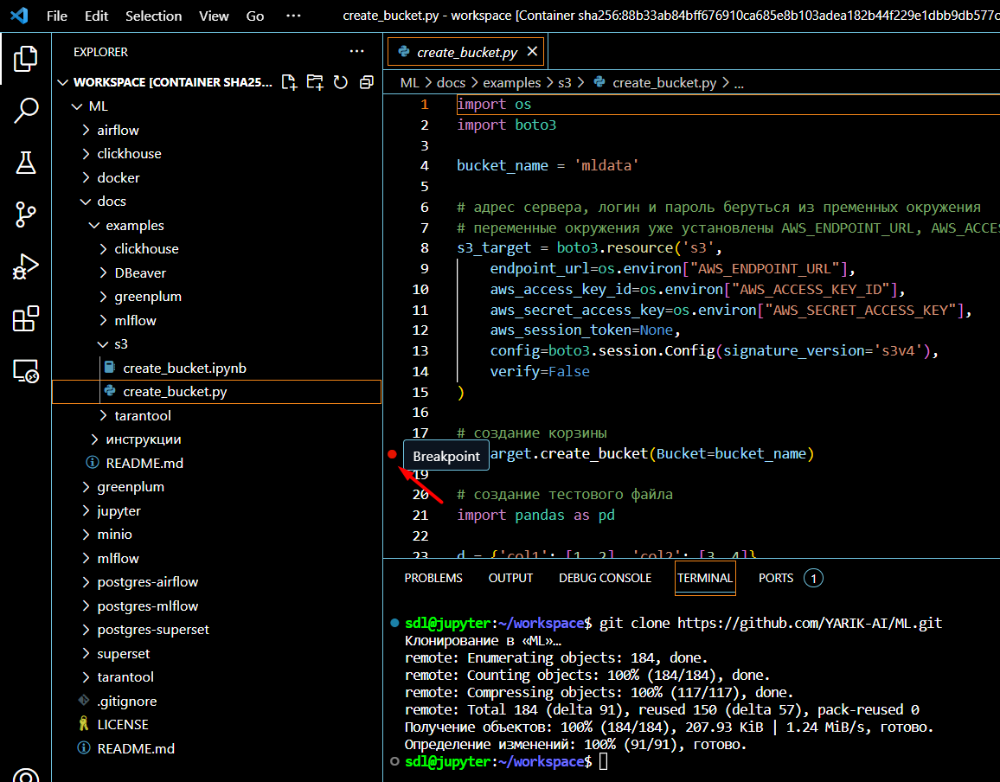

В  панели `Visual Studio Code` выберите меню "Run" -> "Start Debugging".

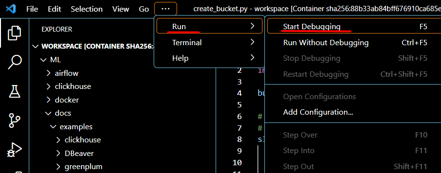

Запустится программный код до точки остановки.

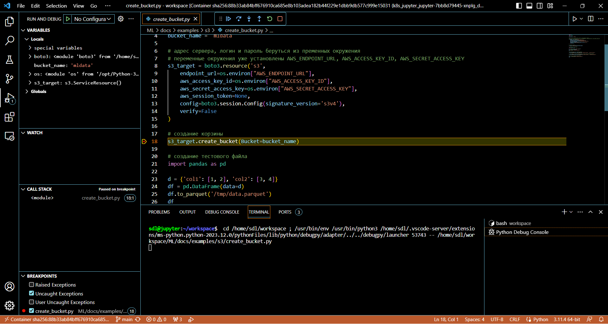

Далее вы можете двигаться по коду, исполнять команды построчно, продолжить выполнять код до следующей остановки, просматривать значения переменных и т.д.