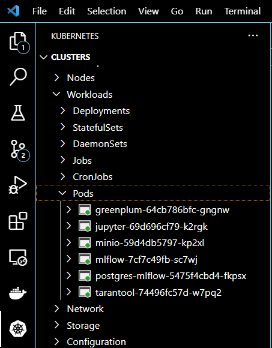
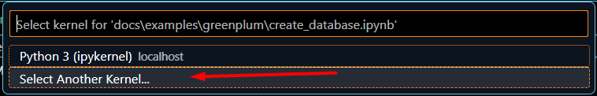
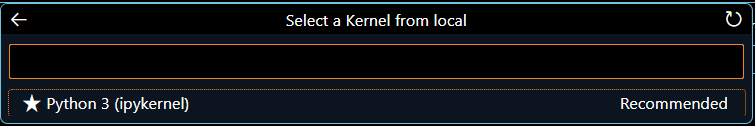

# Инструкция программиста

# Подготовительная работа

Настроить окружение `Visual Studio Code`, для этого установить следующие расширения:

- ms-azuretools.vscode-docker
- ms-toolsai.jupyter
- ms-vscode-remote.remote-containers
- ms-kubernetes-tools.vscode-kubernetes-tools

Убедиться, что необходимые модули запущены, зайти в расширение `Kubernates` в раздел 
`Clusters` -> `Workloads` -> `Pods`. Должен отображаться список запущенных модулей.

* [Работа в jupyter-notebook](#работа-в-jupyter-notebook)

# Работа в jupyter-notebook

Открыть любой из примеров находящихся в папке `docs/examples`.

В правом верхнем углу jupyter-notebook открыть окно выбора ядра исполнения.

Выбрать 'Select Another Kernel'

Выбрать 'Existing jupyter Server ...'

Выбрать 'Existing jupyter Server ...'

Указать адрес сервера

`http://localhost:31188/jupyter/?token=822fce15430e96de9bc18fedf9f938796db4c7927f912028`

или (если ранее настраивали перенаправление порта)

`http://localhost:8888/jupyter/?token=822fce15430e96de9bc18fedf9f938796db4c7927f912028`

Указать имя соединения, например, `local`

Выбрать ядро

Выполнить пример, код будет выполнен внутри контейнера.

